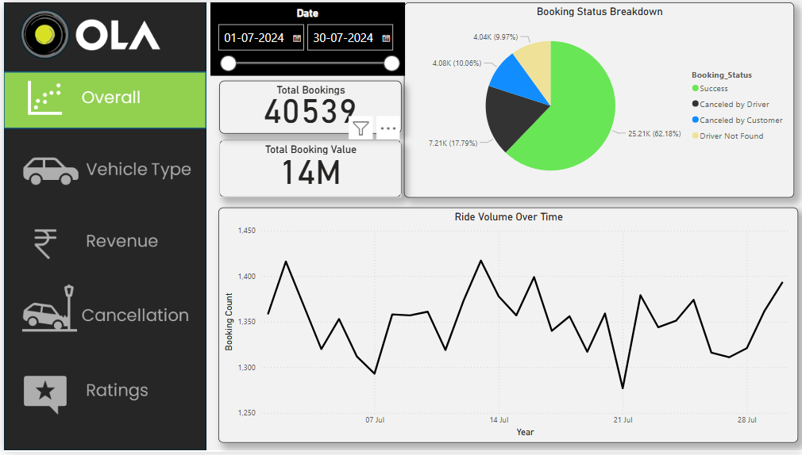
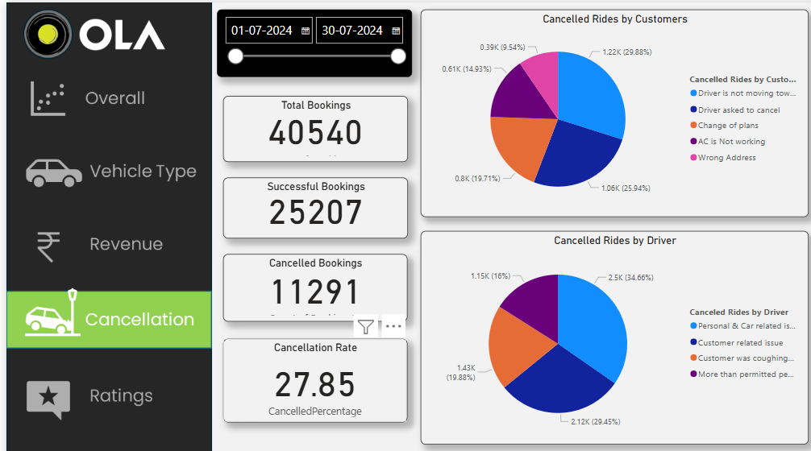

# Ride Booking Data Analysis – Bengaluru, July 2024

## 📁 Project Overview

This project analyzes **40 000+** simulated ride‑booking records for **Bengaluru** in **July 2024** using **Excel**, **MySQL**, and **Power BI**. The goal is to understand booking trends, cancellation patterns, and ride distribution, mirroring the day‑to‑day operations of a real ride‑hailing platform across one month.

---

## 🧰 Tools Used

* **Excel** – initial data entry & light cleaning
* **MySQL** – storage, querying, and aggregation
* **Power BI** – interactive dashboards & visuals

---

## 📊 Dashboard Features

This project tracks more than **20 fields**, including:

* **Date & Time** – booking trends & peak‑hour analysis
* **Booking ID** – unique 10‑digit IDs (e.g. `CNR12345678`)
* **Booking Status** – Successful, Cancelled (Customer/Driver), Incomplete
* **Vehicle Type** – Auto, Bike, Mini, Prime Sedan, etc.
* **Pickup & Drop Locations** – 50 prominent Bengaluru areas
* **Cancellation Reasons** – granular causes captured
* **Ride Metrics** – VTAT, CTAT, ride distance, and more
* **Payment Methods & Booking Values** – tiered for comparison





---

## 🏆 Key Features

* Overall booking success rate maintained at **62%**
* **Cancellation rates:**

  * Customer-initiated: **< 7%**
  * Driver-initiated: **< 18%**
* Simulated real-world demand spikes on **weekends** and **match days**
* **Balanced order values:**

  * 70% of rides under ₹500
  * 28% of rides above ₹500
  * Remaining above ₹100
* **Key insights:**

  * Higher booking values and ride distances on weekends
  * Frequent cancellation reasons analyzed for improving service quality

---

## 📈 Dashboards & Insights

* **Power BI Report:** Includes detailed pages analyzing trends, cancellation rates, and booking behavior.
* **Dashboard Views:** Provide insights into:

  * Total bookings vs. cancellations
  * Vehicle type and payment method breakdowns
  * Booking value distribution
  * Key performance indicators (KPIs)

---

## 📁 Files Included

| File                          | Description                       |
| ----------------------------- | --------------------------------- |
| `Dataset_40000_Bookings.xlsx` | Raw data used for analysis        |
| `OLA_project_dashboard.pbix`  | Power BI report file              |
| `Ola_project.sql`             | SQL script & sample queries       |
| `README.md`                   | Project documentation (this file) |

---

## 🧠 Sample SQL Queries

```sql
-- 1. Total bookings
SELECT COUNT(*) AS Total_Bookings
FROM bookings;
```

```sql
-- 2. Cancelled rides (customer or driver)
SELECT COUNT(*) AS Cancelled_Bookings
FROM bookings
WHERE Booking_Status IN ('Canceled by Customer', 'Canceled by Driver');
```

## 📊 Dataset Highlights

Below is an example of how the dataset is structured:

| Date       | Time     | Booking ID  | Booking Status | Vehicle Type | Pickup Location | Drop Location | Booking Value | Payment Method |
| ---------- | -------- | ----------- | -------------- | ------------ | --------------- | ------------- | ------------- | -------------- |
| 2024‑07‑15 | 08:30 AM | CNR12345678 | Successful     | Prime Sedan  | Koramangala     | Whitefield    | ₹ 480         | Online         |

*(Full dataset contains 40 000+ similar rows.)*

---


## 📬 Contact

• **Email:** rizuahmed09@gmail.com)
• **LinkedIn:** https://www.linkedin.com/in/muntas1r/

---
